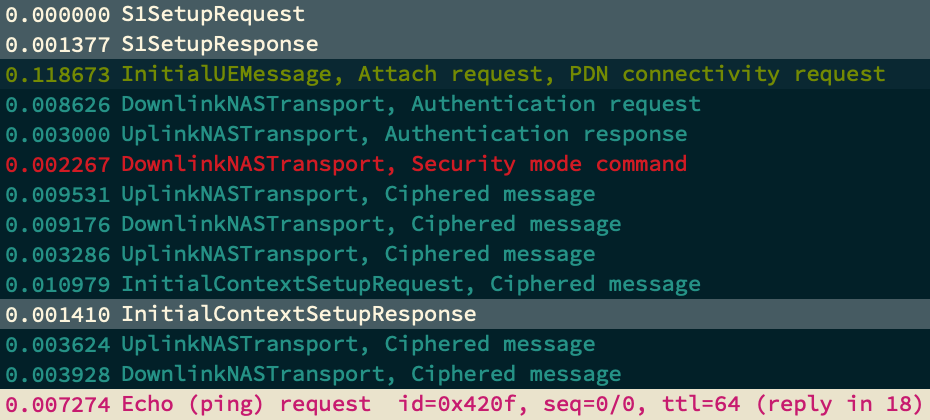

# wireshark-config

My Wireshark profile for LTE & 5G with a simple [solarized](https://github.com/altercation/solarized) color scheme.

Installation:
```
mkdir -p .config/wireshark/profiles
cd .config/wireshark/profiles
git clone https://github.com/mrlnc/configs_wireshark.git LTE
```

You should now have a "LTE" profile in Wireshark.


